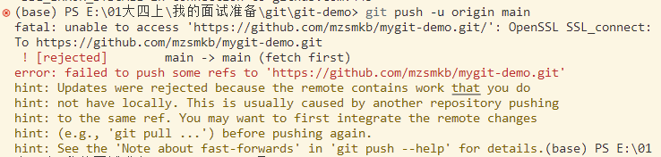
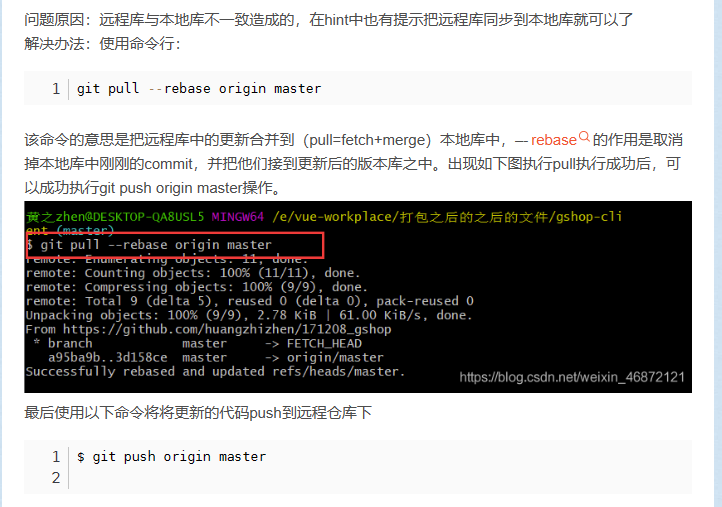

# 文件状态

两种状态：

* 未跟踪
  * 指文件没有被git管理
  * vscode中 显示绿色的 U标就是未跟踪
* 已跟踪
  * 已经被git管理
  * 三种状态
    * 暂存：文件修改已经保存，但是尚未提交到git仓库
    * 未修改：磁盘中的文件和git仓库中的文件相同，没有修改
    * 已修改：磁盘中的文件已被修改，和git仓库中的文件不同

命令：

* git add `<filename> `将文件切换到暂存状态
* git add * 将所有已修改（未跟踪）的文件暂存

  * 未跟踪--->暂存
* git commit -m "xxx" 将暂存的文件存储到仓库中
* git commit -a -m “xxx”  提交所有已修改的文件（未跟踪的文件不会提交）

  * 暂存--->未修改
* 修改代码后，文件会从未修改变成已修改状态

  * 未修改--->修改

其他：

* 重置文件
  * git restore `<filename>	恢复文件`
  * git restore --staged `<filename>	取消暂存状态`
* 删除文件
  * git rm `<filename> 删除文件`
  * git rm `<filename> -f 强制删除文件`
* 移动文件
  * git mv from to 移动文件  重命名文件

# 分支

git在存储文件时，每一次代码的提交都会创建一个与之对应的节点，git就是通过一个一个的节点来记录代码的状态码的。节点会构成一个树状结构，树状结构就意味着这个数存在分支，默认情况下仓库只有一个分支，为master。在使用git时，可以创建多个分支，分支与分支之间相互独立，在一个分支上修改代码不会影响其他的分支。

# aha现在这个分支不走newbranch那条线了

# 这是newbranch里的

* git branch  查看其他的分支情况
* git branch xxx 创建新的分支
* git branch -d xxx  删除xxx分支
* git switch xxx	切换到xxx分支
* git switch -c xxx  创建并切换到xxx分支
* git merge xxx 把xxx与当前选中的分支合并

在开发中，都是在自己的分支上编写代码，代码编写完成后，再将自己的分支合并到主分支当中.

# 变基rebase

还可以通过变基来完成分支的合并

通过merge合并分支时，在提交记录中会将所有的分支创建和分支合并的过程全部都显示出来，这样项目比较复杂，开发过程比较波折，必须要反复的创建、合并、删除分支。这样将会使得代码的提交记录变得极为混乱

原理（变基时发生了什么？）：

* 当我们发起变基时，git会首先找到两条分支的最近的共同祖先
* 对比当前分支相对于祖先的历史提交，并且将他们提取出来存储到一个临时文件中
* 将当前部分指向目标的基底
* 以当前基底开始，重新执行历史操作

变基和merge对于合并分支来说最终的结果都是一样的，但是变基会使得代码的提交记录更加的整洁清晰。

大部分情况下合并和变基是可以互换的，但是如果分支已经提交给了远程仓库，那么此时尽量不要变基

比如，在iss2分支被选中时，执行git rebase master，即可变成一条线

# 远程仓库

## 小问题报错

### 解决办法

# 操作的命令

* git remote 查看当前的远程库
* git remote add <名字> <远程库地址>
* git remote remove <名字>
* git push -u <远程库名> <分支名>   #同远程库

  * 链接之后可以直接git push
  * git push <远程库> <本地分支>:<远程分支>
* git clone <远程库地址>  xxx  #下载远程库到当前目录，且命名为xxx

  * 之后就可以直接git push了，因为已经直接链接到远程库了
* 如果本地的版本低于远程库的版本，push是默认推不上去的，就和上面出现的小问题报错一样的情况

  * 解决方法
    * git fetch   要解决必须让本地版本与远程库同步
      * fetch会从远程库下载所有代码，但是他不会将代码和当前分支自动合并
      * 使用fetch拉去代码后，必须手动对代码进行合并
        * git merge origin/main   意思就是将本地的分支与远程库origin的main分支合并，就是正常的合并步骤
    * git pull 从服务器上拉取代码并自动合并，就和上面那个报错的解决方法一样的

# Tag标签

* git switch <分支id> --detach
* git tag <标签名>
  * 之后可以快速找到该节点
  * git switch <标签名>
  * git push origin <标签名>  push指定的节点
